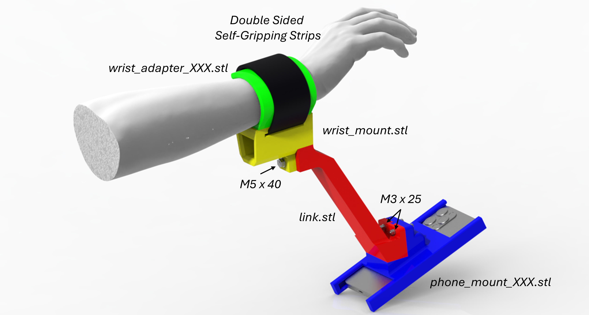

# TeleDex Assembly Guide

## Overview
- Phone-only mode streams the device pose and works without holder.
- The optional holder adds finger tracking using a simple strap-based fixture.

## Quick Start

## 3D-Printed Parts
Print phone holder components (see the STL files in [`printables`](../printables) folder).
- `phone_mount_XXX.stl` (multiple versions available for different iPhones, coming soon)
- `link.stl`
- `wrist_mount.stl`
- `wrist-adapter_XXX.stl` (multiple versions available for different wrist sizes, coming soon)

## Off‑the‑Shelf Items
- Double‑sided self-gripping strips, e.g.
	[external link to Amazon](https://www.amazon.com/Straps-Double-Self-Gripping-Reusable-Multi-Purpose/dp/B0DFVCBQ4J/ref=sr_1_1_sspa?dib=eyJ2IjoiMSJ9.lAO9pug3aqVjexa3Sr63jVYyaCw-QKloqVx4g1d3L-eDZoJmVCzMwRmvQkng8l9ea38wNKtQCk5Pdk3_aBVSEphNul-WeGC0PD3gAvhOMGmKuDLrKq3Pgrul7cRstWYkzYnTSTJvCq9nYbYdbvdi2b8Wsp0vuf2PprRd2Kar4R1yCHfy5C_DqNo1eCS0MGJwnTk4Yh3ayzHi9eu0OX2juXg_qgZfejS_xxtpdaAePGA.CiEP4CmdFt38N5yitwyDnGp66_a71R-klGZSQzsvidA&dib_tag=se&keywords=double%2Bsided%2Bvelcro&qid=1770676691&sr=8-1-spons&sp_csd=d2lkZ2V0TmFtZT1zcF9hdGY&th=1).
- M3 (25mm length) and M5 (40mm length) screws and nuts.
- Soft foam, rubber pad, or wrist sweatband (optional, for comfort and better fit).

## Assembly Steps
1. 3D-print parts.
2. Assemble all parts as shown above; insert M3/M5 screws and tighten them.
3. Route the velcro strap; add foam pad if needed.
4. Mount phone; keep cameras/sensors unobstructed.

## Next Steps
- See [GUIDE.md](../GUIDE.md) to get started with the software.
- Refer to the main [README.md](../README.md) for usage examples and API.
